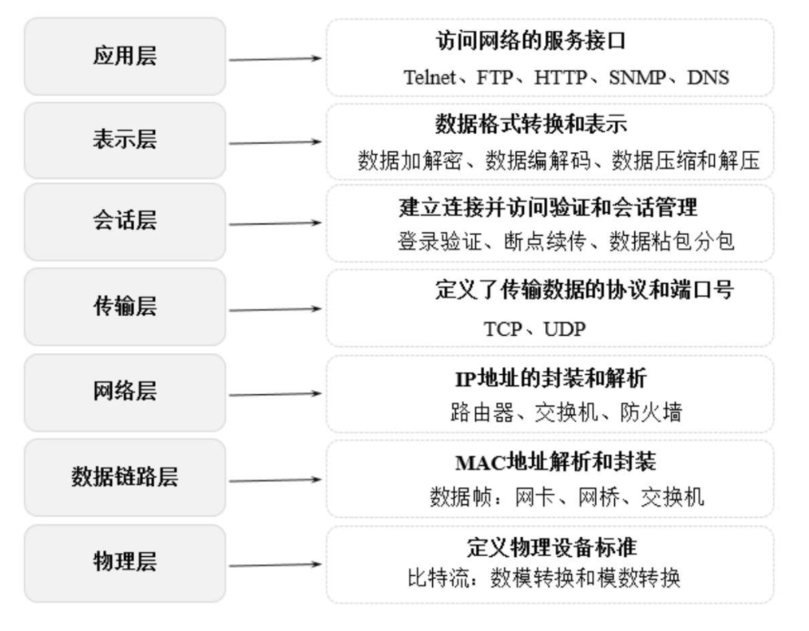
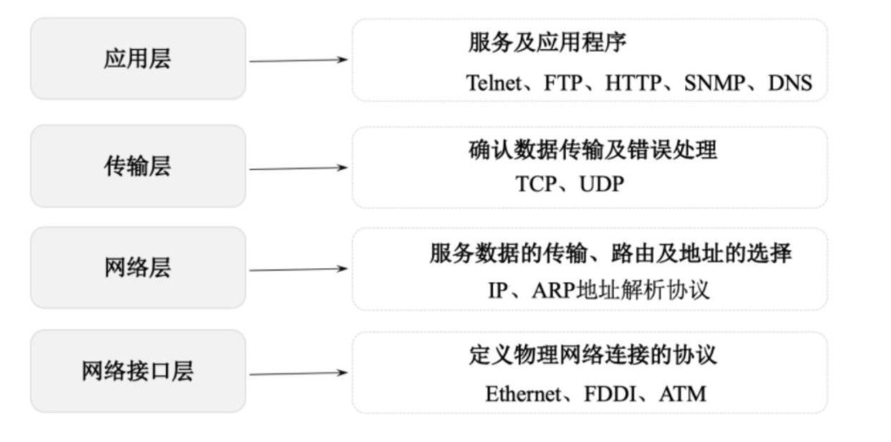

# 网络模型

## OSI七层网络模型

​	网络七层架构从低至上主要包括：物理层、数据链路层、网络层、传输层、会话层、表示层、应用层。

​	

### 物理层

​	主要定义物理设备的标准，主要作用是传输比特流，具体是在发送端将1、0转化为电流强弱来进行传输，在接收端再将电流强弱转化为1、0，也就是模拟信号和数字信号的转换，这一层的数据叫比特。

### 数据链路层

​	对数据包中的MAC地址进行解析和封装，这一层的数据叫帧；主要的设备有网卡、网桥、交换机。

### 网络层

​	对数据包中的IP地址进行封装和解析，这一层的数据叫数据包；主要的设备有路由器、交换机、防火墙等。

### 传输层

​	定义传输数据的协议和端口号，主要用于数据的分段、传输和重组；主要协议有TCP和UDP等；TCP是传输控制协议，传输效率低，可靠性强，用于传输对可靠性要求高、数据量大的数据；UDP是用户数据报协议，用于传输可靠性要求不高、数据量小的数据。

### 会话层

​	在传输层的基础上建立连接和管理会话，包括登录验证、断点续传、数据沾包和分包等。

### 表示层

​	主要对接收的数据进行解释、加密、解密、压缩、解压缩等，把计算机能够识别的内容转换成人能够识别的内容。

### 应用层

​	基于网络构建具体的用于，如FTP文件上传下载服务、Telnet服务、HTTP服务、DNS服务、SNMP邮件服务等。

## TCP/IP四层网络模型

​	指因特网整个TCP/IP协议簇；由网络接口层、网络层、传输层和应用层组成。

​	

### 网络接口层

​	定义主机间网络连通的协议，包括Echernet、FDDI、ATM等通讯协议。

### 网络层

​	主要用于数据的传输、路由及地址的解析，以保障主机可以把数据发送给任何网络上的目标；数据经过网络传输，发送的顺序和到达的顺序可能发送变化；使用IP和地址解析协议ARP。

### 传输层

​	使源端和目的端机器上的对等实体可以基于会话相互通信；定义了两个端到端的协议TCP和UDP；TCP是面向连接的协议，提供可靠的报文传输和对上层应用的连接服务，有基本的数据传输、可靠性保证、流量控制、多路复用、优先权和安全性控制等功能；UDP是面向无连接的不可靠传输协议，主要用于不需要TCP的排序和流量控制等功能的应用程序。

### 应用层

## OSI与TCP/IP体系结构对比

